# Plugin System — Technical Design

**Version:** 1.0.0  
**Status:** Describes the running system. Two tiers exist: Tier 1 (Manifest) and
Tier 2 (Script/boa_engine).  
**Last Updated:** 2026-08-09

> **On Tier 3.** `PluginTier::Service` still parses, and such a plugin installs, but
> `PluginRegistry::dispatch_before_hook` matches it with
> `tracing::debug!("Tier 3 hook (M3) — allowing")` and runs nothing: no sidecar
> supervisor, no socket protocol, no per-plugin migration runner. The design for it
> used to be written out here in full, which made most of this document a description
> of software that does not exist. It has been removed — recover it from git history
> if that work is ever picked up. Nothing below describes anything unbuilt.

---

## Table of Contents

1. [Overview](#1-overview)
2. [System Architecture](#2-system-architecture)
3. [Plugin Tiers](#3-plugin-tiers)
4. [Plugin Lifecycle](#4-plugin-lifecycle)
5. [Hook Dispatch Flow](#5-hook-dispatch-flow)
6. [Frontend Slot System](#6-frontend-slot-system)
7. [Database Design](#7-database-design)
8. [Security Model](#8-security-model)
9. [API Reference](#9-api-reference)
10. [Configuration Reference](#10-configuration-reference)

---

## 1. Overview

The Ferum Board plugin system extends the forum without modifying core code. It is designed around six non-negotiable principles:

| Principle | Meaning |
|---|---|
| **Forum First** | Forum runs 100% correctly even when all plugins are disabled |
| **Fail-Safe** | A crashing plugin never brings down the forum |
| **Least Privilege** | A plugin only receives the exact data it declares it needs |
| **Explicit Consent** | Admin must understand and grant each capability before activation |
| **Owned Boundaries** | Plugins own their own data, schema, and migration history |
| **Observable** | Every plugin action is logged and auditable |

### Relationship to Existing System

The current webhook system handles ~60% of external integration needs. The plugin system builds on top of it rather than replacing it:

```
Webhooks ──► Tier 1 Manifest Plugins  (declarative, config-driven)
                    +
             Tier 2 Script Plugins    (sandboxed JS: before-hooks, after-events,
                                       RPC actions, own SQL schema, UI slots)
```

---

## 2. System Architecture

### 2.1 High-Level Overview

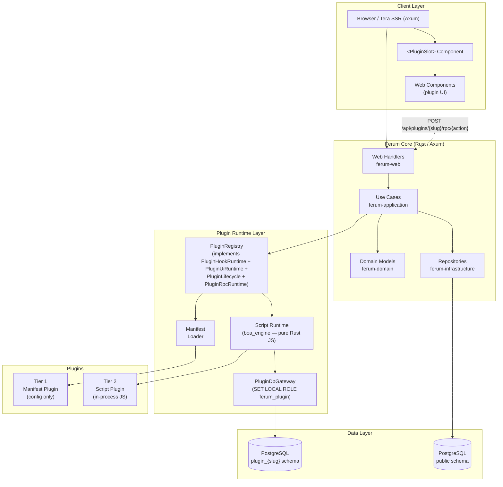

Tier 2 runs **in-process**, not as a child process: `boa_engine` is a Rust JavaScript
engine linked into the binary, so there is nothing to supervise, no IPC and no
heartbeat. Each plugin gets its own JS thread and its own `Context`.

### 2.2 Dependency Flow

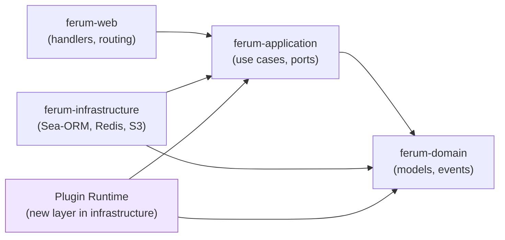

The plugin runtime sits inside `ferum-infrastructure` and depends only on `ferum-application` port traits and `ferum-domain` types — the same constraint as any other infrastructure adapter.

---

## 3. Plugin Tiers

### 3.1 Capability Matrix

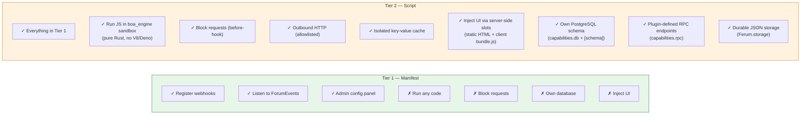

Not available at any tier: running as a separate process, mounting arbitrary route
trees, and replacing a core provider such as search or notifications.

### 3.2 Tier Selection Guide

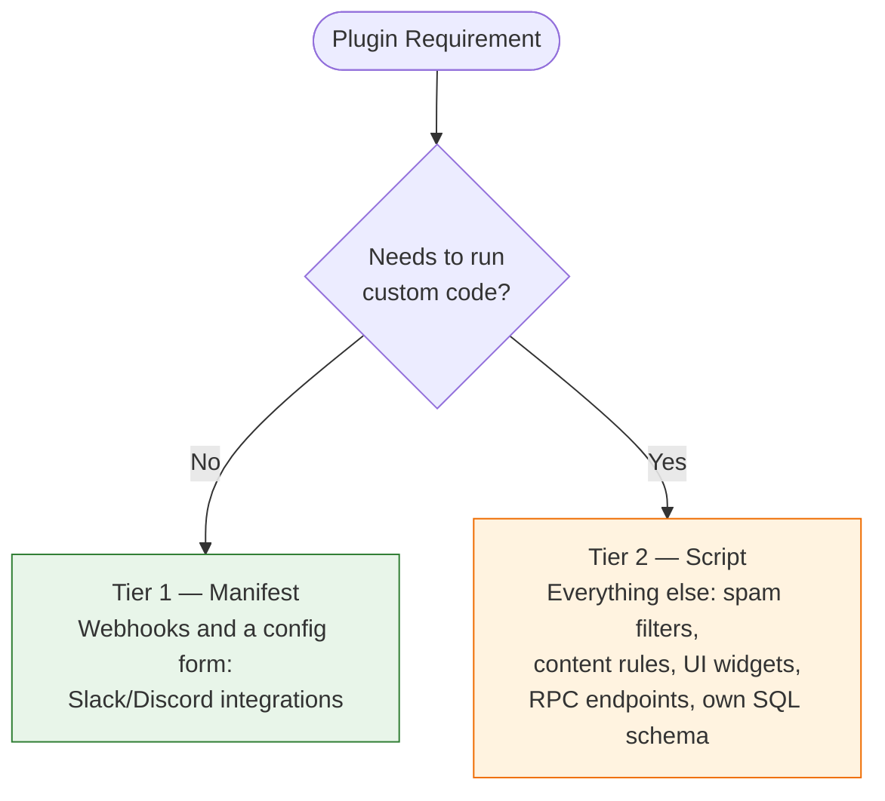

The chatbox, poll widget and homepage masthead under `examples/plugins/` are all
Tier 2 — including the two that own persistent state.

---

## 4. Plugin Lifecycle

### 4.1 State Machine

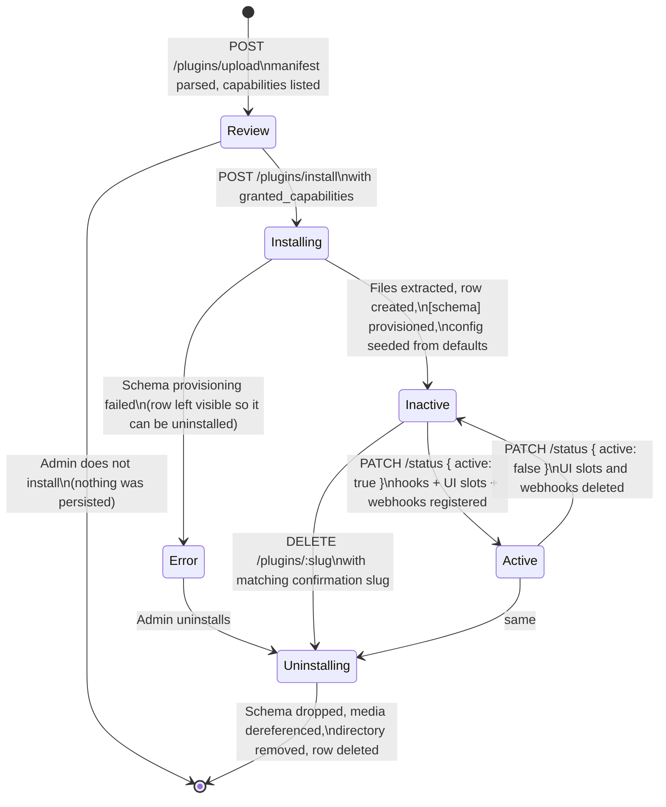

Two states in the DB enum are not reachable through the flow above.
`PluginStatus::Installing` is the row's initial value and `register_extracted`
transitions out of it before returning, so it is only ever observed if the process
dies mid-install. `Disabled` exists in the enum and nothing sets it.

**There is no update path.** Installing over an existing slug returns
`plugin_already_installed` (409); upgrading means uninstall then install, which drops
the plugin's schema and its data. **Deactivating is not the same as uninstalling** —
it deletes the UI slot rows and the plugin's webhooks and empties the in-memory
dispatch table, but leaves the schema, the config and the hook rows intact, so
reactivating restores the plugin exactly.

The circuit breaker (§5.3) is separate from this state machine: an open circuit skips
the plugin at dispatch time without changing `status`.

### 4.2 Install Sequence

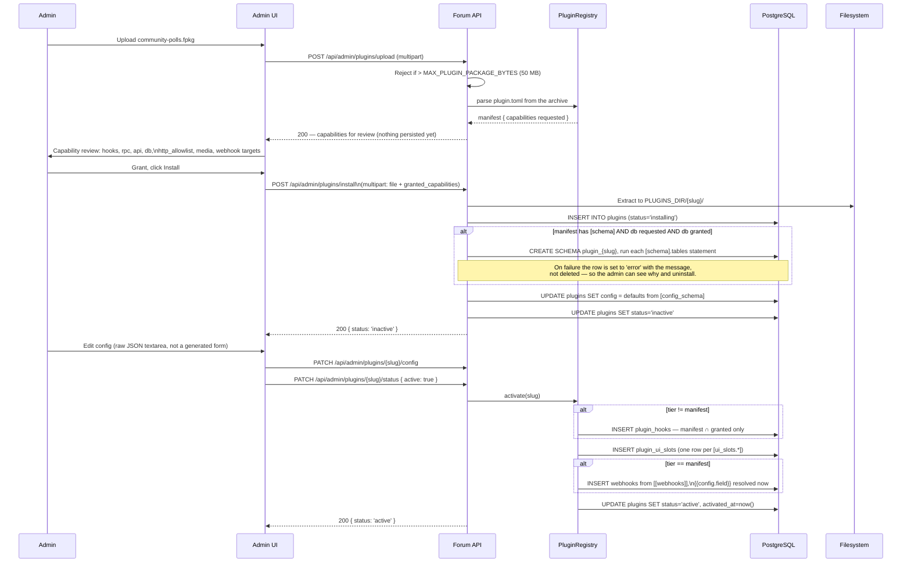

Three details in that sequence are load-bearing:

- **Config defaults are seeded at install**, from `default` in `[config_schema]`.
  Without it a plugin installs with `config = {}` however carefully its manifest
  describes what it wants, and the operator's first experience is a plugin that
  activates cleanly and then does nothing — no error, no log line.
- **`{{config.field}}` in a webhook URL is resolved at activation**, from the config
  as it stands then. The same is true of `[ui_slots.*].props`. Editing config
  afterwards does not rewrite either; only deactivate-then-activate does.
- **Granted capabilities are intersected with the manifest at every step**, not
  trusted from the manifest alone — a hook requested but not granted is skipped with
  a log line rather than registered.

---

## 5. Hook Dispatch Flow

### 5.1 Before-Hook (Synchronous Gate)

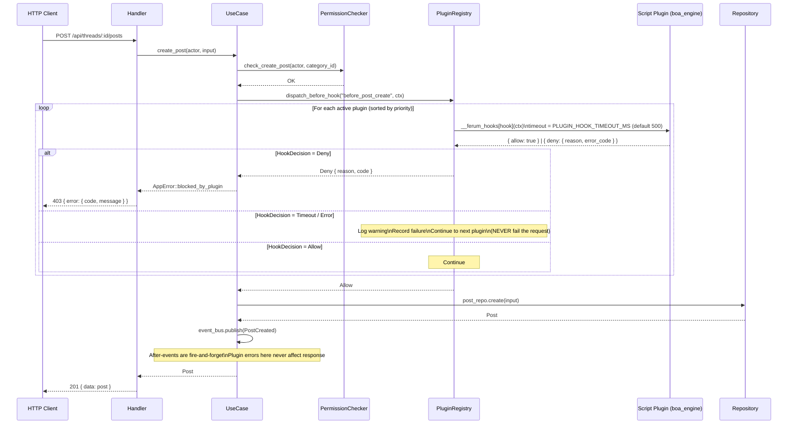

### 5.2 After-Event (Fire-and-Forget)

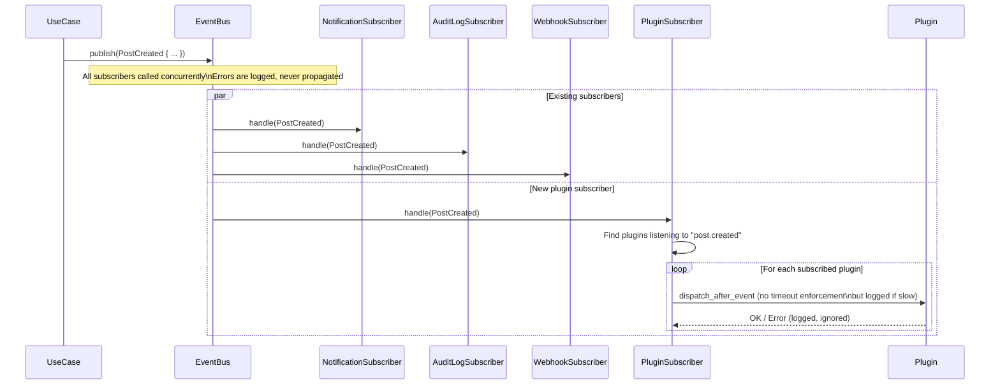

### 5.3 Circuit Breaker Logic

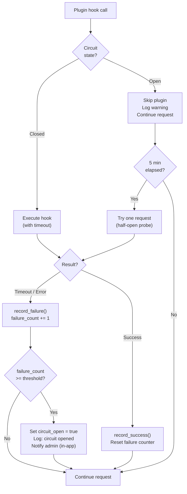

---

## 6. Frontend Slot System

### 6.1 Available Slots

A slot name is an arbitrary string in the database. It renders only where a template
asks for `plugin_slots.<name>`, so the real slot roster is whatever the active theme
renders — not a list the backend defines.

The built-in theme renders five:

| Slot | Template | Appears on |
| --- | --- | --- |
| `content_before` | `themes/default/templates/base.html` | every page |
| `content_after` | `themes/default/templates/base.html` | every page |
| `navbar_end` | `themes/default/templates/partials/nav.html` | every page |
| `sidebar_left_top` | `themes/default/templates/partials/sidebar_left.html` | pages carrying the left sidebar |
| `home_feed_top` | `themes/default/templates/home.html` | the homepage only |

**There are no admin-panel slots.** No template under `frontend/templates/` renders
`plugin_slots`, so a plugin cannot inject into the admin or moderator panels.

Because `home_feed_top` lives in `home.html` rather than `base.html`, a theme that
overrides `home.html` must render it explicitly. The three example themes
(`ferum-review`, `ferum-sumi`, `ferum-arcade`) all override that template and all
render the slot; a theme that forgets silently drops every homepage widget.

### 6.2 Slot Injection Architecture

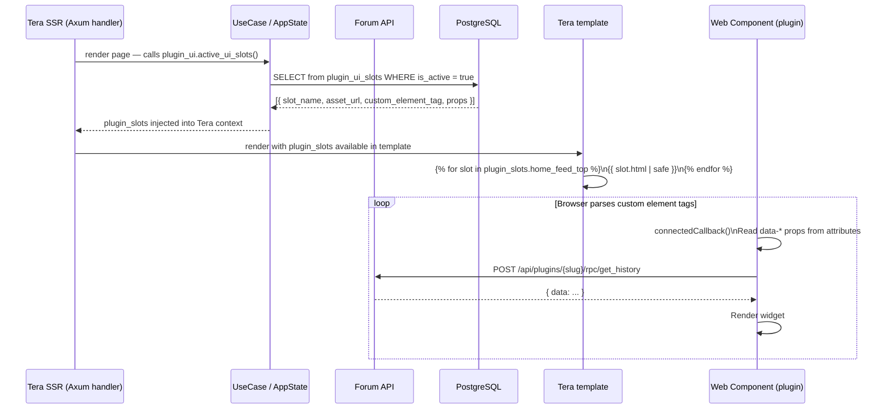

The template renders a pre-built HTML string (`slot.html`), not the individual fields:
`plugin_ctx_data()` in `handlers/pages/mod.rs` assembles the element and its
attributes server-side, and `plugin_assets` carries the `<script>` tags separately.
Ordering is `(load_order, plugin_slug, slot_name)` — the slug tiebreak is not
decoration, since every plugin's first slot is seeded at `load_order = 100` and a SQL
sort alone would leave two widgets' order to the planner, swapping them between
refreshes.

### 6.3 Web Component Loading and Element Naming

The element name is not chosen by the plugin. It is
`ferum_domain::models::plugin::ui_slot_element_tag(slug, slot_name)`: the constant
prefix `ferum-slot-`, then the plugin id, then the slot name, each lowercased with
every run of non-alphanumeric characters folded to a single `-`.

Two properties of that rule are load-bearing:

- **The constant prefix** makes the result a legal custom-element name for any plugin
  id. An id starting with a digit would otherwise make `customElements.define` throw
  and take down the whole bundle, not just that widget.
- **The slug is included**, which is what allows several plugins to occupy one slot.
  Named after the slot alone, two plugins in `home_feed_top` would emit two identical
  tags, both `define` calls would race for the one name, and the winner would render
  into both elements. The visible symptom is one widget appearing twice and the other
  not at all, with nothing logged.

`custom_element_tag` is written to the row at activation **and derived again on every
read** (`slot_from_entity`), and the read wins. A row created under an older naming
rule is therefore self-correcting, which is why changing the rule needs no migration.

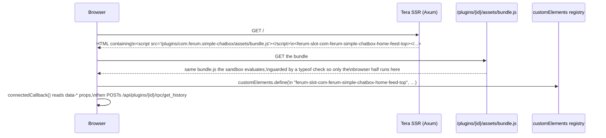

`backend/tests/domain/src/models/plugin.rs` reads every `examples/plugins/*/plugin.toml`
and asserts the bundle contains the tag the server will emit, so the two halves of the
contract cannot drift apart silently.

---

## 7. Database Design

### 7.1 Entity Relationship Diagram

```mermaid
erDiagram
    plugins {
        uuid id PK
        text slug UK
        text name
        text version
        plugin_tier tier
        plugin_status status
        jsonb manifest
        jsonb config
        jsonb granted_capabilities
        text install_path
        text db_schema_name
        int db_schema_version
        uuid installed_by FK
        timestamptz installed_at
        timestamptz updated_at
        timestamptz activated_at
        text error_message
        timestamptz last_seen_at
        int restart_count
        bool circuit_open
    }

    plugin_hooks {
        uuid id PK
        uuid plugin_id FK
        text hook_name
        int priority
        bool is_active
        int avg_ms
        timestamptz created_at
    }

    plugin_ui_slots {
        uuid id PK
        uuid plugin_id FK
        text slot_name
        text asset_url
        text custom_element_tag
        text_array props
        int load_order
        bool is_active
    }

    plugin_logs {
        uuid id PK
        uuid plugin_id FK
        text level
        text hook_name
        int duration_ms
        text message
        jsonb context
        timestamptz created_at
    }

    plugin_storage {
        uuid plugin_id PK_FK
        text key PK
        jsonb value
        timestamptz updated_at
    }

    users {
        uuid id PK
        text username
    }

    plugins ||--o{ plugin_hooks : "registers"
    plugins ||--o{ plugin_ui_slots : "contributes"
    plugins ||--o{ plugin_logs : "emits"
    plugins ||--o{ plugin_storage : "owns"
    users ||--o{ plugins : "installs"
```

Three columns on `plugins` are read but never written: `db_schema_version`,
`last_seen_at` and `restart_count`. The last two were for supervising a sidecar;
`restart_count` is still serialised into the admin API response, where it is
permanently `0`. `db_schema_name` is set at install, but nothing versions the schema
afterwards — which is why there is no plugin upgrade path (§4.1).

### 7.2 Plugin-Owned Schema Pattern

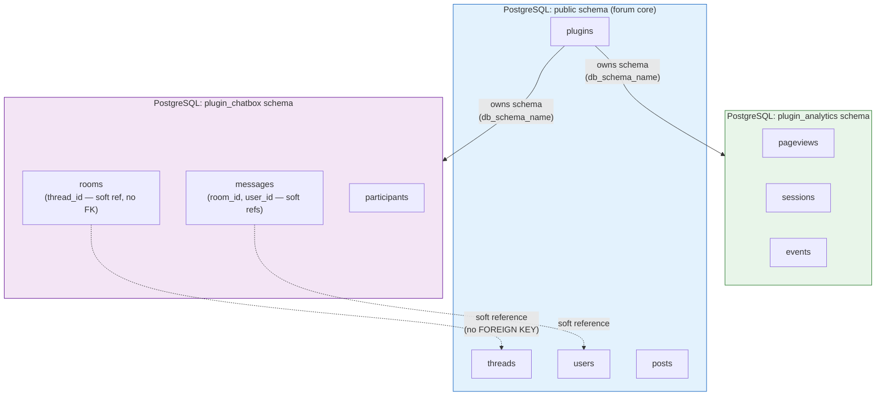

**Why no cross-schema FOREIGN KEYs?** Plugins must be loosely coupled to core. A
plugin cleans up by subscribing to the `thread.deleted` after-event, not via cascade
constraints, so it can be installed and uninstalled without altering the core schema.
`Ferum.db.query` could not create such a constraint anyway: it runs as `ferum_plugin`,
which has no rights on `public`.

The diagram shows two illustrative schemas; the only worked example in the repository
is `examples/plugins/community-polls`, whose `[schema]` block creates three tables in
`plugin_com_ferum_community_polls`.

### 7.3 SQL Schema

```sql
-- ─── Enums ────────────────────────────────────────────────────────────────────
CREATE TYPE plugin_tier AS ENUM ('manifest', 'script', 'service');
CREATE TYPE plugin_status AS ENUM (
    'installing', 'active', 'inactive', 'error', 'disabled', 'uninstalling'
);

-- ─── Plugins ──────────────────────────────────────────────────────────────────
CREATE TABLE plugins (
    id                   UUID PRIMARY KEY DEFAULT gen_random_uuid(),
    slug                 TEXT UNIQUE NOT NULL,
    name                 TEXT NOT NULL,
    version              TEXT NOT NULL,
    tier                 plugin_tier NOT NULL,
    status               plugin_status NOT NULL DEFAULT 'installing',
    manifest             JSONB NOT NULL,
    config               JSONB NOT NULL DEFAULT '{}',
    granted_capabilities JSONB NOT NULL DEFAULT '{}',
    install_path         TEXT NOT NULL,
    db_schema_name       TEXT,
    db_schema_version    INT NOT NULL DEFAULT 0,
    installed_by         UUID REFERENCES users ON DELETE SET NULL,
    installed_at         TIMESTAMPTZ NOT NULL DEFAULT now(),
    updated_at           TIMESTAMPTZ NOT NULL DEFAULT now(),
    activated_at         TIMESTAMPTZ,
    error_message        TEXT,
    last_seen_at         TIMESTAMPTZ,
    restart_count        INT NOT NULL DEFAULT 0,
    circuit_open         BOOLEAN NOT NULL DEFAULT false
);

-- ─── Plugin Hooks ─────────────────────────────────────────────────────────────
CREATE TABLE plugin_hooks (
    id          UUID PRIMARY KEY DEFAULT gen_random_uuid(),
    plugin_id   UUID NOT NULL REFERENCES plugins ON DELETE CASCADE,
    hook_name   TEXT NOT NULL,
    priority    INT NOT NULL DEFAULT 100,
    is_active   BOOLEAN NOT NULL DEFAULT true,
    avg_ms      INT,
    created_at  TIMESTAMPTZ NOT NULL DEFAULT now()
);

CREATE INDEX idx_plugin_hooks_dispatch
    ON plugin_hooks (hook_name, is_active, priority)
    WHERE is_active = true;

-- ─── Plugin UI Slots ──────────────────────────────────────────────────────────
CREATE TABLE plugin_ui_slots (
    id                  UUID PRIMARY KEY DEFAULT gen_random_uuid(),
    plugin_id           UUID NOT NULL REFERENCES plugins ON DELETE CASCADE,
    slot_name           TEXT NOT NULL,
    asset_url           TEXT NOT NULL,
    custom_element_tag  TEXT NOT NULL,
    props               TEXT[] NOT NULL DEFAULT '{}',
    load_order          INT NOT NULL DEFAULT 100,
    is_active           BOOLEAN NOT NULL DEFAULT true
);

CREATE INDEX idx_plugin_ui_slots_lookup
    ON plugin_ui_slots (slot_name, is_active, load_order)
    WHERE is_active = true;

-- ─── Plugin Logs ──────────────────────────────────────────────────────────────
-- Nothing prunes this table. Growth is bounded at the write side instead, by
-- PluginLogSink: one writer task, batched inserts, a bounded channel of 1024,
-- and entries DROPPED (counted, and reported once a minute) when a producer
-- outruns it. `Ferum.log.info()` used to spawn a task per call, so a loop in a
-- hook could queue thousands of INSERTs and exhaust the connection pool — the
-- hook itself timed out and failed open, and every *other* request then failed.
CREATE TABLE plugin_logs (
    id          UUID PRIMARY KEY DEFAULT gen_random_uuid(),
    plugin_id   UUID NOT NULL REFERENCES plugins ON DELETE CASCADE,
    level       TEXT NOT NULL CHECK (level IN ('trace','info','warn','error')),
    hook_name   TEXT,
    duration_ms INT,
    message     TEXT NOT NULL,
    context     JSONB,
    created_at  TIMESTAMPTZ NOT NULL DEFAULT now()
);

-- ─── Plugin Storage (migration 000020) ────────────────────────────────────────
-- Backs Ferum.storage.*: durable, plugin-scoped KV, the persistent counterpart
-- to the TTL-bound cache. Namespacing is the composite PK plus the repository
-- layer always binding plugin_id — a plugin cannot reach another's keys
-- whatever key string it passes.
CREATE TABLE plugin_storage (
    plugin_id  UUID NOT NULL REFERENCES plugins ON DELETE CASCADE,
    key        TEXT NOT NULL,
    value      JSONB NOT NULL,
    updated_at TIMESTAMPTZ NOT NULL DEFAULT now(),
    PRIMARY KEY (plugin_id, key)
);
```

---

## 8. Security Model

### 8.1 Trust Boundaries

Tier 2 runs **in the forum's own process**, so the boundary is not a process boundary.
It is drawn by three mechanisms: what the sandbox's global object exposes, what
PostgreSQL grants the `ferum_plugin` role, and what the allowlist permits outbound.

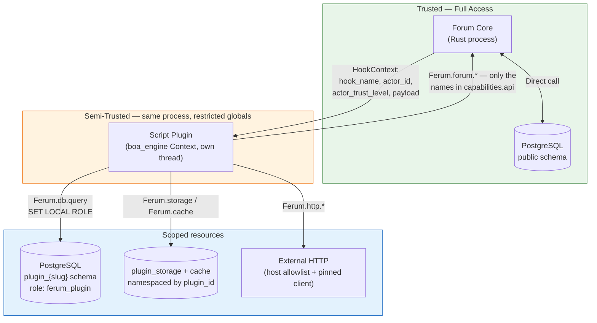

The plugin never receives a database handle, an `AppState`, or a domain model. It
receives a `HookContext` of four plain JSON-serialisable fields, and everything it can
reach back through is a named function on the `Ferum` global that the host installed
deliberately.

Sharing the process has one consequence worth stating plainly: `boa_engine` is a
memory-safe interpreter, so a plugin cannot corrupt the host's memory, but it is not a
resource jail. The defences against a plugin consuming the machine are the per-hook
timeout and the circuit breaker, not an OS boundary.

### 8.2 What a Plugin Can Never Access

| Resource | Tier 1 | Tier 2 |
|---|:---:|:---:|
| `AppState` (raw) | ✗ | ✗ |
| Core DB connection | ✗ | ✗ |
| Core tables via SQL | ✗ | ✗ |
| User password hashes | ✗ | ✗ |
| JWT signing secret | ✗ | ✗ |
| Email addresses | ✗ | ✗ |
| Another plugin's config, cache keys or storage keys | ✗ | ✗ |
| Forum filesystem | ✗ | ✗ |

Two of these are enforced by something other than the absence of an API, which is
worth stating because it changes how much they can be relied on:

- **Core tables.** `Ferum.db.query` runs inside a transaction that issues
  `SET LOCAL search_path TO "plugin_{slug}"` and `SET LOCAL ROLE ferum_plugin`. That
  role is `NOLOGIN` and holds no grant on any application table, so
  `SELECT … FROM public.users` is refused by PostgreSQL itself rather than by string
  matching. `SET LOCAL` unwinds at COMMIT, so a pooled connection is never returned
  still holding the reduced role. `validate_plugin_sql` is an independent second
  layer, and it still matters: on a database whose owner lacks `CREATEROLE` the
  migration warns and continues without creating the role, and that layer is then the
  only one left.
- **Cross-plugin isolation.** `Ferum.cache` and `Ferum.storage` are namespaced by
  `plugin_id` at the repository layer, not by a prefix the plugin passes. No key
  string can escape the namespace.

### 8.3 Plugin identity

There is no plugin service token and no `PLUGIN_INTERNAL_SECRET`. Tier 2 code runs
in-process, so it has no network identity to authenticate: what it may do is decided
by `granted_capabilities` intersected with the manifest, at each dispatch. A token
would only become relevant if Tier 3 were built.

### 8.4 Content Security Policy for Plugin UI

The CSP is set by the application, in
`ferum-web/src/middleware/security_headers.rs` — not by the reverse proxy, and there
are no per-request nonces.

```
Content-Security-Policy:
  default-src 'self';
  script-src  'self' 'unsafe-eval';
  style-src   'self' 'unsafe-inline';
  img-src     'self' data: blob: <storage origin, if not same-origin>;
  connect-src 'self';
  font-src    'self' data:;
  frame-ancestors 'none';
  base-uri 'self';
  form-action 'self'
```

What this means for a plugin:

- **Its bundle is covered by `'self'`.** Plugin assets are served from the same origin
  at `/plugins/{id}/assets/{path}`, so no directive needs widening.
- **Inline `<script>` and `on*=` attributes are blocked.** Put all behaviour in
  `bundle.js`; an inline handler in a `props` string will not run.
- **`'unsafe-eval'` is present** because Alpine.js compiles its directives with the
  `Function` constructor. It is not there for plugins, and relying on it is a bad bet.
- **`connect-src 'self'`.** A plugin's browser half cannot call an external API
  directly. Route it through an RPC action and `Ferum.http.*`, which is also where the
  allowlist and SSRF protection live.
- **`img-src` is the only directive that widens**, and it does so automatically:
  `startup.rs` appends the storage adapter's origin so uploads served from S3, GCS or
  a CDN load. `script-src` and `connect-src` deliberately do not follow — a bucket
  holds user-uploaded bytes, and letting it serve scripts to this origin would turn an
  upload-validation bug into code execution.

---

## 9. API Reference

### 9.1 Admin Plugin Management

| Method | Path | Description |
|---|---|---|
| `GET` | `/api/admin/plugins` | List all installed plugins |
| `POST` | `/api/admin/plugins/upload` | Upload `.fpkg` file (multipart) — returns temp path for review |
| `POST` | `/api/admin/plugins/install` | Confirm install after capability review |
| `GET` | `/api/admin/plugins/:slug` | Plugin detail + current status |
| `PATCH` | `/api/admin/plugins/:slug/config` | Update config values |
| `PATCH` | `/api/admin/plugins/:slug/status` | Activate / deactivate |
| `DELETE` | `/api/admin/plugins/:slug` | Uninstall plugin |
| `GET` | `/api/admin/plugins/:slug/logs` | Plugin execution logs |
| `GET` | `/api/admin/plugins/:slug/ui-slots` | List this plugin's UI slot placements |
| `PATCH` | `/api/admin/plugins/:slug/ui-slots/:slot_id` | Move a slot / change `load_order` — effective immediately |

`POST /api/admin/plugins/debug/hooks` also exists, but only in debug builds
(`#[cfg(debug_assertions)]`).

### 9.2 How a plugin reaches core data

There is **no** `/api/plugins/_internal/*` route tree and no plugin service token. A
Tier 2 plugin reads core data through two capability-gated calls inside the sandbox:

| Call | Capability required |
|---|---|
| `Ferum.forum.getUserPublic(userId)` | `"forum.getUserPublic"` in `capabilities.api` |
| `Ferum.forum.createNotification(userId, message)` | `"forum.createNotification"` in `capabilities.api` |

Anything beyond those two is not reachable. Its own relational data goes through
`Ferum.db.query`, which runs as the `ferum_plugin` role and can see only
`plugin_{slug}`.

### 9.3 Plugin-defined endpoints

Not dynamically mounted routes — two fixed endpoints, dispatched by slug:

| Method | Path | Description |
|---|---|---|
| `POST` | `/api/plugins/:slug/rpc/:action` | Invokes `__ferum_rpc[action]`. Not auth-gated: guests arrive with `ctx.actor_id = null`, and each handler decides. Rate-limited as a public write. Does not fail open. |
| `POST` | `/api/plugins/:slug/media` | Multipart image upload into the plugin's own CAS namespace. Requires auth and `granted_capabilities.media`. |
| `GET` | `/plugins/:slug/assets/*path` | Serves the plugin's bundle and other assets. Only the `assets/` subtree is exposed, so manifests and sources stay unreachable. |

### 9.4 Slot hydration

| Method | Path | Description |
|---|---|---|
| `GET` | `/api/plugins/active-slots` | All active UI slot registrations. |

Slots are also injected server-side into the Tera context as `plugin_slots.<name>`,
which is how the built-in theme renders them; the endpoint exists for clients that
need the same data.

---

## 10. Configuration Reference

### 10.1 Forum-Side Plugin Config

There is no `PluginConfig` struct. The three tunable values are plain fields on
`Config` in `ferum-web/src/config.rs`, alongside every other setting; the rest are
constants.

| Value | Where | Default |
|---|---|---|
| `plugins_dir` | `Config` (`PLUGINS_DIR`) | `./plugins` |
| `plugin_hook_timeout_ms` | `Config` (`PLUGIN_HOOK_TIMEOUT_MS`) | 500 |
| `plugin_circuit_threshold` | `Config` (`PLUGIN_CIRCUIT_THRESHOLD`) | 10 |
| `MAX_PLUGIN_PACKAGE_BYTES` | `ferum-application/src/constants.rs` | 50 MB |
| circuit failure window | hard-coded in `registry.rs` at `CircuitBreaker::new` | 3600s |
| circuit reset (half-open) | hard-coded in `registry.rs` at `CircuitBreaker::new` | 300s |

**Neither a memory cap nor a cache quota exists.** `script_max_memory_mb` and
`script_cache_quota_kb` appeared in an earlier draft of this section and were never
implemented — `boa_engine` is given no heap limit, and `Ferum.cache` is bounded only
by the shared cache backend. A plugin's runaway allocation is contained by the hook
timeout and the circuit breaker, not by a quota.

The circuit breaker is **in-memory and per hook registration**. `plugins.circuit_open`
in the database is admin visibility only: it is not consulted at dispatch, and a
restart or a plugin reload starts every circuit closed again.

### 10.2 Environment Variables

Three, all read by `ferum-web/src/config.rs`:

```bash
PLUGINS_DIR=./plugins            # where packages are extracted (default ./plugins)
PLUGIN_HOOK_TIMEOUT_MS=500       # per before_* hook; exceeding it kills the call and allows
PLUGIN_CIRCUIT_THRESHOLD=10      # consecutive failures before the circuit opens
```

Note the singular `PLUGIN_` prefix on the latter two. Earlier revisions of this
document listed them as `PLUGINS_*` and added a `PLUGIN_INTERNAL_SECRET` for signing
service tokens; none of those three names is read anywhere in the codebase, and the
last belongs to the unimplemented Tier 3.

Whether Tier 2 exists at all is a **compile-time** decision, not an environment one:
the `script_plugins` cargo feature (on by default) is what links `boa_engine`. A host
built with `--no-default-features` reports Script plugins as unsupported.
