# Plugin System — Technical Design

**Version:** 1.0.0  
**Status:** Implemented — Tier 1 (Manifest) + Tier 2 (Script/boa_engine) done; Tier 3 (Service) planned  
**Last Updated:** 2026-06-23

---

## Table of Contents

1. [Overview](#1-overview)
2. [System Architecture](#2-system-architecture)
3. [Plugin Tiers](#3-plugin-tiers)
4. [Plugin Lifecycle](#4-plugin-lifecycle)
5. [Hook Dispatch Flow](#5-hook-dispatch-flow)
6. [Frontend Slot System](#6-frontend-slot-system)
7. [Database Design](#7-database-design)
8. [Security Model](#8-security-model)
9. [API Reference](#9-api-reference)
10. [Configuration Reference](#10-configuration-reference)

---

## 1. Overview

The Ferum Board plugin system extends the forum without modifying core code. It is designed around six non-negotiable principles:

| Principle | Meaning |
|---|---|
| **Forum First** | Forum runs 100% correctly even when all plugins are disabled |
| **Fail-Safe** | A crashing plugin never brings down the forum |
| **Least Privilege** | A plugin only receives the exact data it declares it needs |
| **Explicit Consent** | Admin must understand and grant each capability before activation |
| **Owned Boundaries** | Plugins own their own data, schema, and migration history |
| **Observable** | Every plugin action is logged and auditable |

### Relationship to Existing System

The current webhook system handles ~60% of external integration needs. The plugin system builds on top of it rather than replacing it:

```
Webhooks ──► Tier 1 Manifest Plugins  (declarative, config-driven)
                    +
             Tier 2 Script Plugins    (sandboxed JS, before-hooks)
                    +
             Tier 3 Service Plugins   (sidecar process, full capability)
```

---

## 2. System Architecture

### 2.1 High-Level Overview

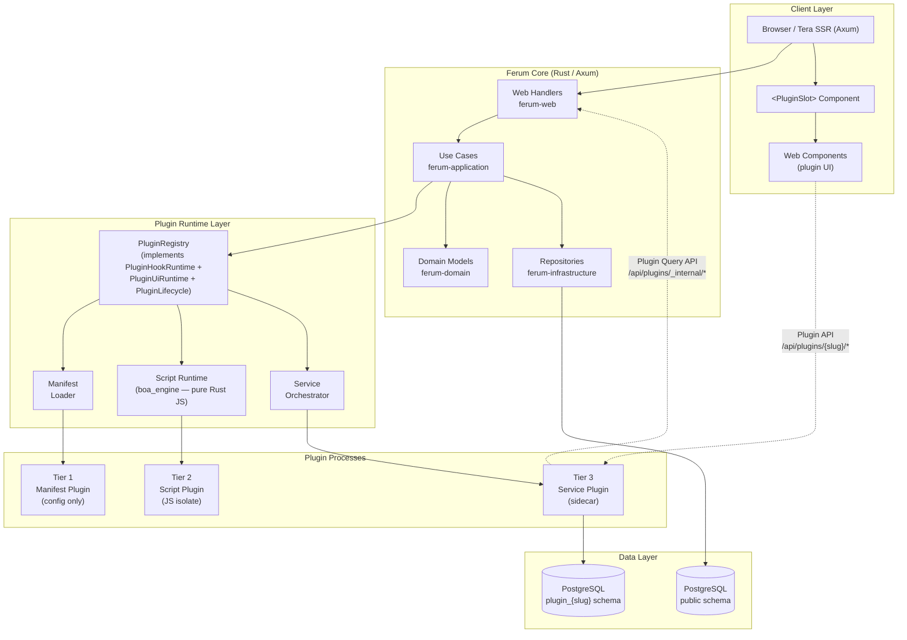

### 2.2 Dependency Flow

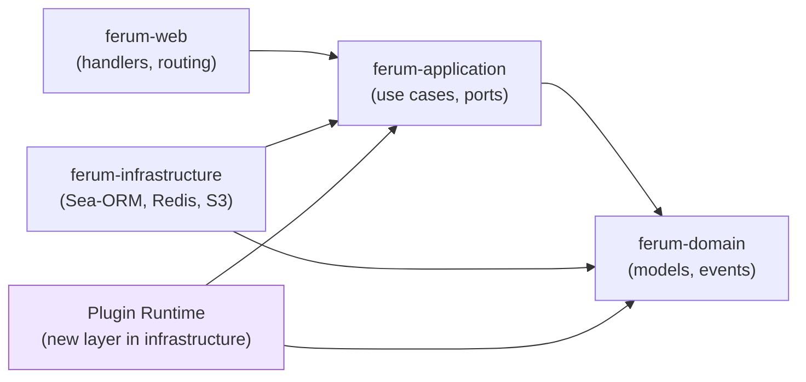

The plugin runtime sits inside `ferum-infrastructure` and depends only on `ferum-application` port traits and `ferum-domain` types — the same constraint as any other infrastructure adapter.

---

## 3. Plugin Tiers

### 3.1 Capability Matrix

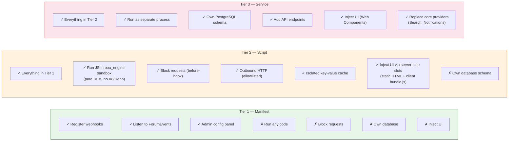

### 3.2 Tier Selection Guide

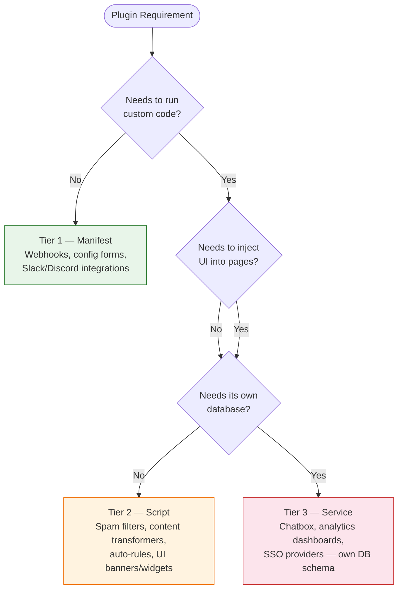

---

## 4. Plugin Lifecycle

### 4.1 State Machine

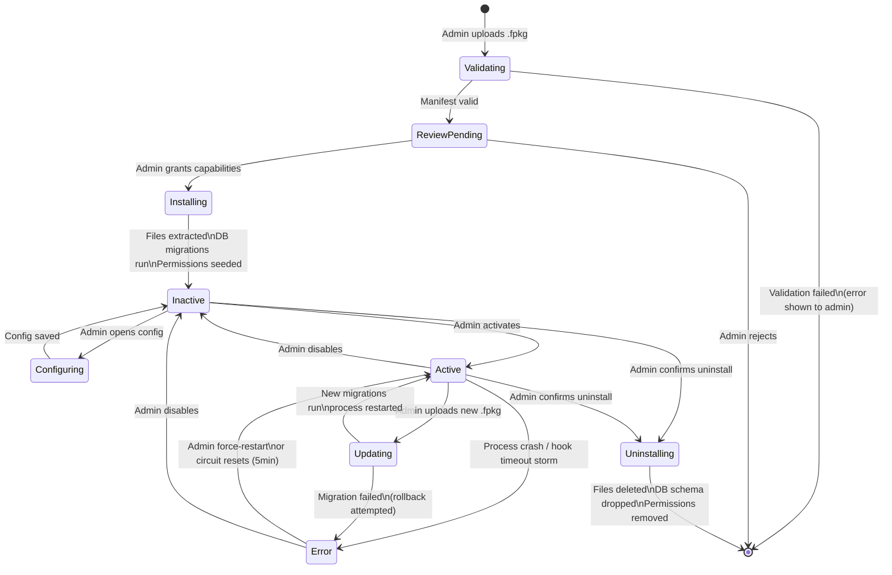

### 4.2 Install Sequence

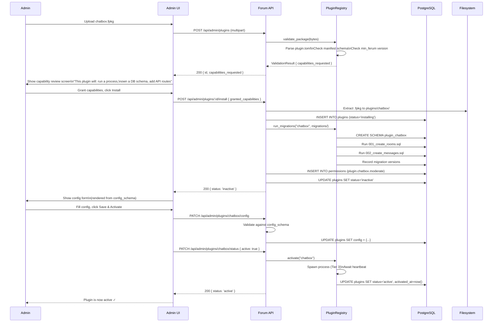

---

## 5. Hook Dispatch Flow

### 5.1 Before-Hook (Synchronous Gate)

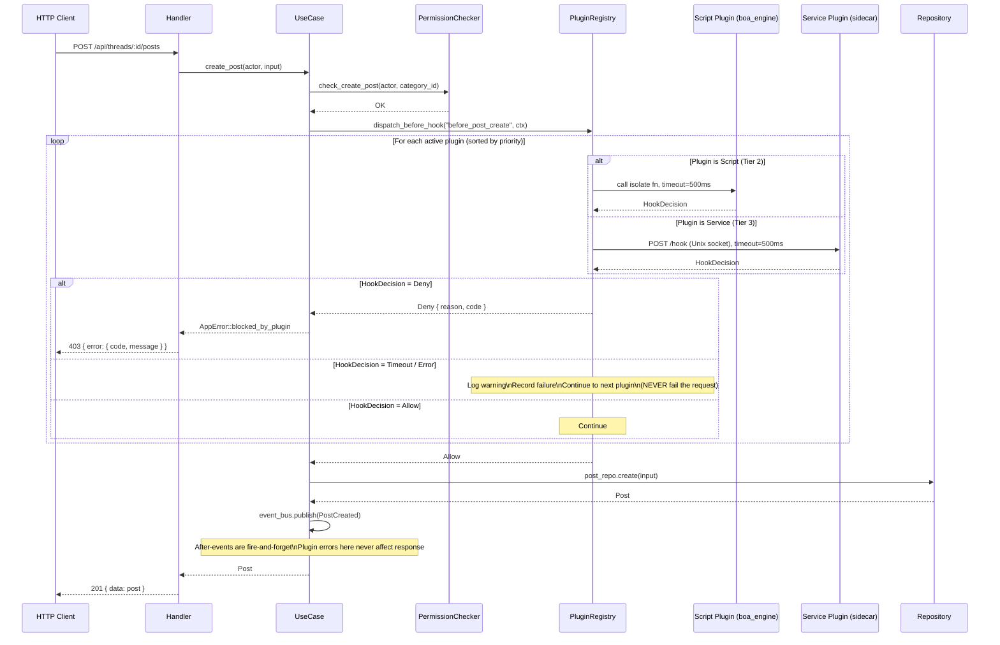

### 5.2 After-Event (Fire-and-Forget)

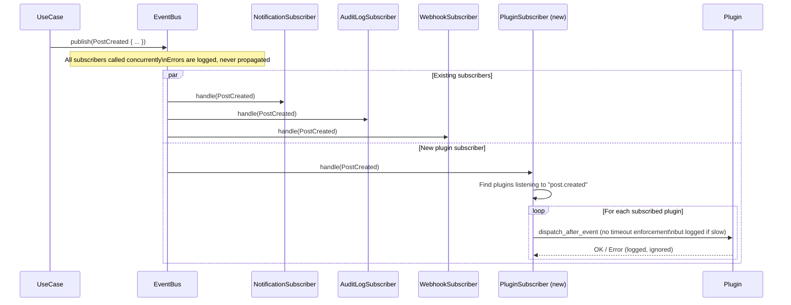

### 5.3 Circuit Breaker Logic

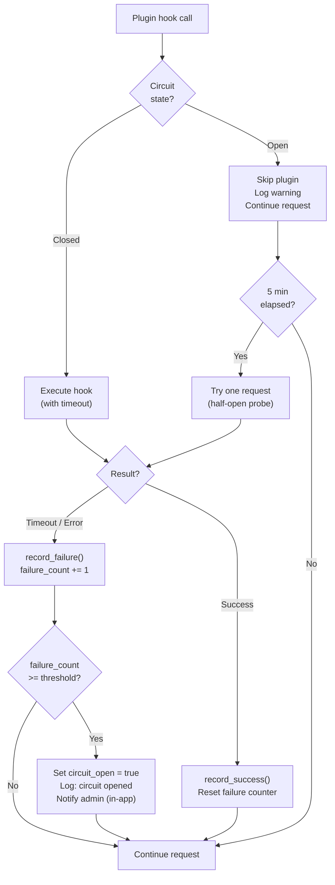

---

## 6. Frontend Slot System

### 6.1 Available Slots

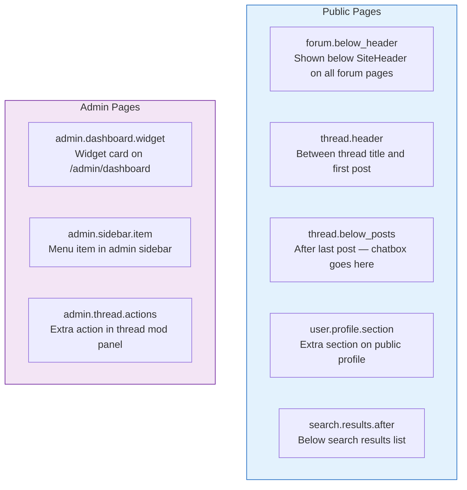

### 6.2 Slot Injection Architecture

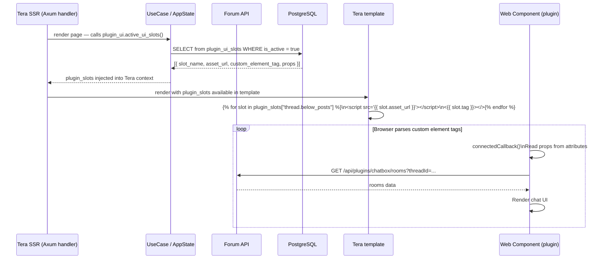

### 6.3 Web Component Loading

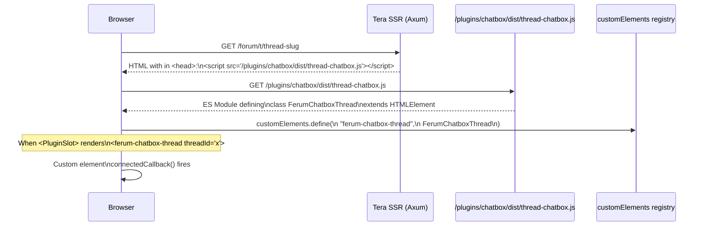

---

## 7. Database Design

### 7.1 Entity Relationship Diagram

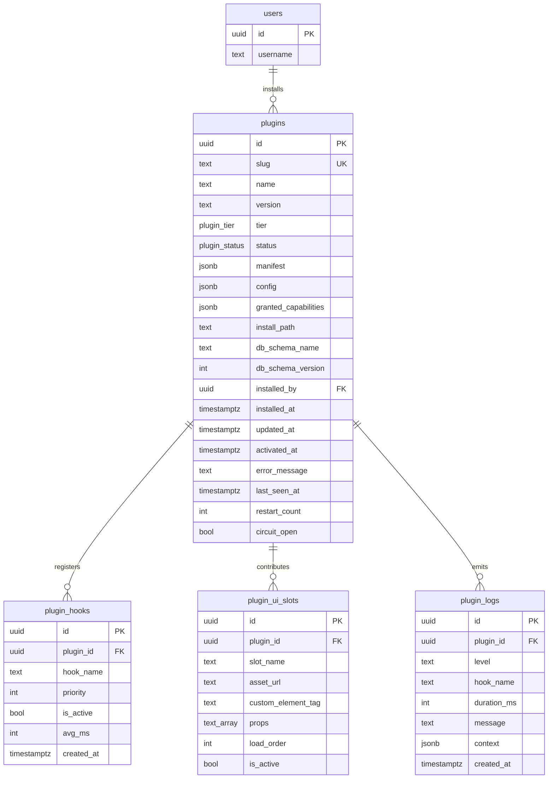

### 7.2 Plugin-Owned Schema Pattern

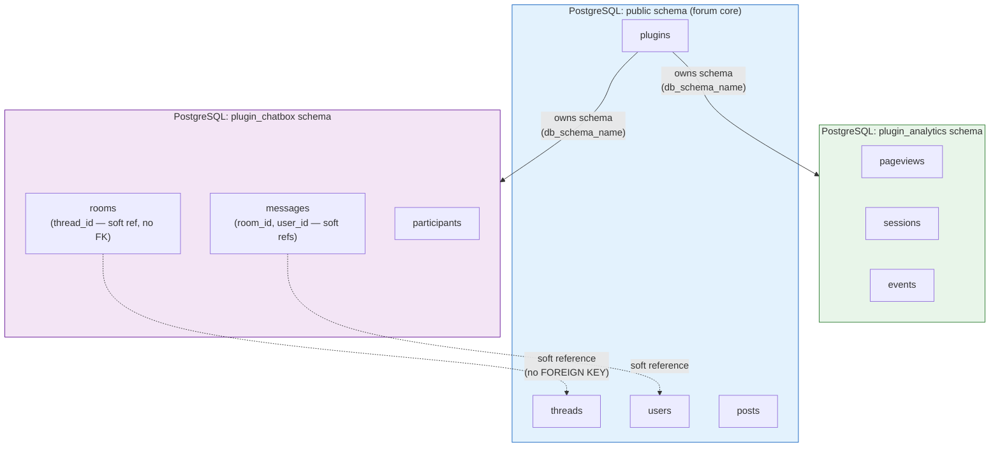

**Why no cross-schema FOREIGN KEYs?** Plugins must be loosely coupled to core. When a thread is deleted, the plugin cleans up via the `after_thread_deleted` event hook — not via cascade constraints. This allows the plugin to be installed and uninstalled without altering core schema.

### 7.3 SQL Schema

```sql
-- ─── Enums ────────────────────────────────────────────────────────────────────
CREATE TYPE plugin_tier AS ENUM ('manifest', 'script', 'service');
CREATE TYPE plugin_status AS ENUM (
    'installing', 'active', 'inactive', 'error', 'disabled', 'uninstalling'
);

-- ─── Plugins ──────────────────────────────────────────────────────────────────
CREATE TABLE plugins (
    id                   UUID PRIMARY KEY DEFAULT gen_random_uuid(),
    slug                 TEXT UNIQUE NOT NULL,
    name                 TEXT NOT NULL,
    version              TEXT NOT NULL,
    tier                 plugin_tier NOT NULL,
    status               plugin_status NOT NULL DEFAULT 'installing',
    manifest             JSONB NOT NULL,
    config               JSONB NOT NULL DEFAULT '{}',
    granted_capabilities JSONB NOT NULL DEFAULT '{}',
    install_path         TEXT NOT NULL,
    db_schema_name       TEXT,
    db_schema_version    INT NOT NULL DEFAULT 0,
    installed_by         UUID REFERENCES users ON DELETE SET NULL,
    installed_at         TIMESTAMPTZ NOT NULL DEFAULT now(),
    updated_at           TIMESTAMPTZ NOT NULL DEFAULT now(),
    activated_at         TIMESTAMPTZ,
    error_message        TEXT,
    last_seen_at         TIMESTAMPTZ,
    restart_count        INT NOT NULL DEFAULT 0,
    circuit_open         BOOLEAN NOT NULL DEFAULT false
);

-- ─── Plugin Hooks ─────────────────────────────────────────────────────────────
CREATE TABLE plugin_hooks (
    id          UUID PRIMARY KEY DEFAULT gen_random_uuid(),
    plugin_id   UUID NOT NULL REFERENCES plugins ON DELETE CASCADE,
    hook_name   TEXT NOT NULL,
    priority    INT NOT NULL DEFAULT 100,
    is_active   BOOLEAN NOT NULL DEFAULT true,
    avg_ms      INT,
    created_at  TIMESTAMPTZ NOT NULL DEFAULT now()
);

CREATE INDEX idx_plugin_hooks_dispatch
    ON plugin_hooks (hook_name, is_active, priority)
    WHERE is_active = true;

-- ─── Plugin UI Slots ──────────────────────────────────────────────────────────
CREATE TABLE plugin_ui_slots (
    id                  UUID PRIMARY KEY DEFAULT gen_random_uuid(),
    plugin_id           UUID NOT NULL REFERENCES plugins ON DELETE CASCADE,
    slot_name           TEXT NOT NULL,
    asset_url           TEXT NOT NULL,
    custom_element_tag  TEXT NOT NULL,
    props               TEXT[] NOT NULL DEFAULT '{}',
    load_order          INT NOT NULL DEFAULT 100,
    is_active           BOOLEAN NOT NULL DEFAULT true
);

CREATE INDEX idx_plugin_ui_slots_lookup
    ON plugin_ui_slots (slot_name, is_active, load_order)
    WHERE is_active = true;

-- ─── Plugin Logs (rolling; older entries pruned by a background job) ──────────
CREATE TABLE plugin_logs (
    id          UUID PRIMARY KEY DEFAULT gen_random_uuid(),
    plugin_id   UUID NOT NULL REFERENCES plugins ON DELETE CASCADE,
    level       TEXT NOT NULL CHECK (level IN ('trace','info','warn','error')),
    hook_name   TEXT,
    duration_ms INT,
    message     TEXT NOT NULL,
    context     JSONB,
    created_at  TIMESTAMPTZ NOT NULL DEFAULT now()
);
```

---

## 8. Security Model

### 8.1 Trust Boundaries

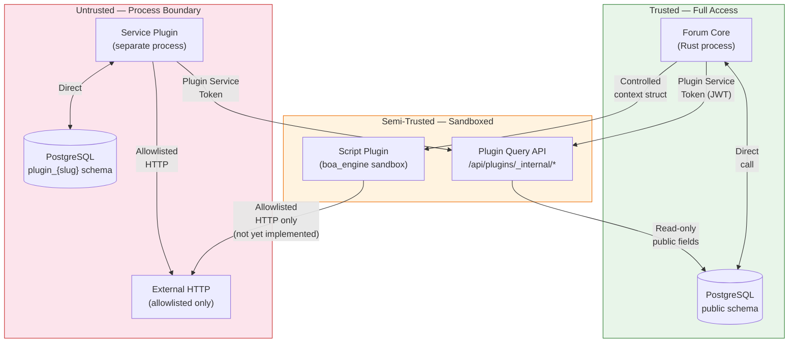

### 8.2 What a Plugin Can Never Access

| Resource | Tier 1 | Tier 2 | Tier 3 |
|---|:---:|:---:|:---:|
| `AppState` (raw) | ✗ | ✗ | ✗ |
| Core DB connection | ✗ | ✗ | ✗ |
| User password hashes | ✗ | ✗ | ✗ |
| JWT signing secret | ✗ | ✗ | ✗ |
| Email addresses (unconfirmed) | ✗ | ✗ | ✗ |
| Other plugins' config | ✗ | ✗ | ✗ |
| Forum filesystem (outside plugin dir) | ✗ | ✗ | ✗ |

### 8.3 Plugin Service Token

Tier 3 plugins authenticate against the Plugin Query API using a short-lived JWT:

```
Header:  { "alg": "HS256", "typ": "JWT" }
Payload: {
  "sub": "plugin:com.example.chatbox",
  "iss": "ferum-board",
  "iat": 1748900000,
  "exp": 1748900060,          // 60-second expiry, auto-refreshed
  "scope": [
    "read:threads",
    "read:users.public"
  ]
}
Signed with: PLUGIN_INTERNAL_SECRET (not the user JWT_SECRET)
```

### 8.4 Content Security Policy for Plugin UI

```
# Forum default CSP (in Nginx)
Content-Security-Policy:
  default-src 'self';
  script-src  'self' 'nonce-{request-nonce}';
  style-src   'self' 'unsafe-inline';

# Plugin Web Components are served from the same origin (/plugins/...)
# so they are covered by 'self'. No wildcard needed.
# Plugin components that call external APIs must do so server-side
# (through their sidecar), not from the browser.
```

---

## 9. API Reference

### 9.1 Admin Plugin Management

| Method | Path | Description |
|---|---|---|
| `GET` | `/api/admin/plugins` | List all installed plugins |
| `POST` | `/api/admin/plugins/upload` | Upload `.fpkg` file (multipart) — returns temp path for review |
| `POST` | `/api/admin/plugins/install` | Confirm install after capability review |
| `GET` | `/api/admin/plugins/:slug` | Plugin detail + current status |
| `PATCH` | `/api/admin/plugins/:slug/config` | Update config values |
| `PATCH` | `/api/admin/plugins/:slug/status` | Activate / deactivate |
| `DELETE` | `/api/admin/plugins/:slug` | Uninstall plugin |
| `GET` | `/api/admin/plugins/:slug/logs` | Plugin execution logs (supports ?level=&since=) |

### 9.2 Plugin Query API (Internal — for plugins only)

Authenticated with Plugin Service Token header: `X-Ferum-Plugin-Token: <jwt>`

| Method | Path | Scope Required |
|---|---|---|
| `GET` | `/api/plugins/_internal/threads/:id` | `read:threads` |
| `GET` | `/api/plugins/_internal/threads` | `read:threads` |
| `GET` | `/api/plugins/_internal/users/:id` | `read:users.public` |
| `GET` | `/api/plugins/_internal/categories` | `read:categories` |
| `GET` | `/api/plugins/_internal/tags` | `read:tags` |

### 9.3 Plugin Public API (Tier 3 — mounted dynamically)

Routes declared in `api_routes` are forwarded by the forum to the plugin's sidecar:

```
Forum API Gateway
    │
    ├── /api/plugins/chatbox/*  ──► Chatbox sidecar (Unix socket proxy)
    ├── /api/plugins/analytics/* ──► Analytics sidecar
    └── ...
```

The forum acts as a reverse proxy: it validates the user's auth, injects `X-Ferum-User-Id` and `X-Ferum-User-Permissions` headers, then proxies to the plugin.

### 9.4 Plugin Slot API (Frontend hydration)

| Method | Path | Description |
|---|---|---|
| `GET` | `/api/plugins/active-slots` | Returns all active UI slots for SSR hydration |

Response:
```json
{
  "thread.below_posts": [
    {
      "pluginId": "...",
      "pluginSlug": "com.example.chatbox",
      "assetUrl": "/plugins/com.example.chatbox/dist/thread-chatbox.js",
      "customElementTag": "ferum-chatbox-thread",
      "props": ["threadId", "categorySlug", "currentUser"],
      "loadOrder": 100
    }
  ]
}
```

---

## 10. Configuration Reference

### 10.1 Forum-Side Plugin Config (`config.rs`)

```rust
pub struct PluginConfig {
    /// Directory where extracted plugins are stored
    pub plugins_dir: PathBuf,                    // default: ./plugins/

    /// Max size of an uploaded .fpkg file
    pub max_package_size_bytes: u64,             // default: 50MB

    /// Default timeout for before-hooks
    pub hook_timeout_ms: u64,                    // default: 500

    /// Failures per window before circuit opens (per hook per plugin)
    pub circuit_open_threshold: u32,             // default: 10

    /// Window for counting failures
    pub circuit_window_secs: u64,                // default: 3600 (1 hour)

    /// How long before a tripped circuit is retried
    pub circuit_reset_secs: u64,                 // default: 300 (5 min)

    /// Max script plugin isolate memory
    pub script_max_memory_mb: u32,               // default: 64

    /// Max key-value cache per script plugin
    pub script_cache_quota_kb: u32,              // default: 512
}
```

### 10.2 Environment Variables

```bash
PLUGINS_DIR=/var/ferum/plugins           # where .fpkg files are extracted
PLUGINS_HOOK_TIMEOUT_MS=500              # global default hook timeout
PLUGINS_CIRCUIT_THRESHOLD=10            # failures before circuit opens
PLUGIN_INTERNAL_SECRET=<random-32-hex>  # HMAC key for Plugin Service Tokens
                                         # MUST be different from JWT_SECRET
```
